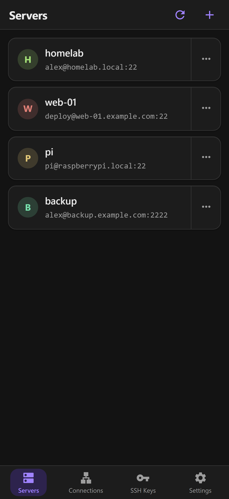
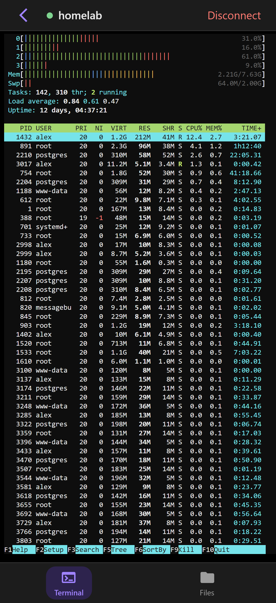
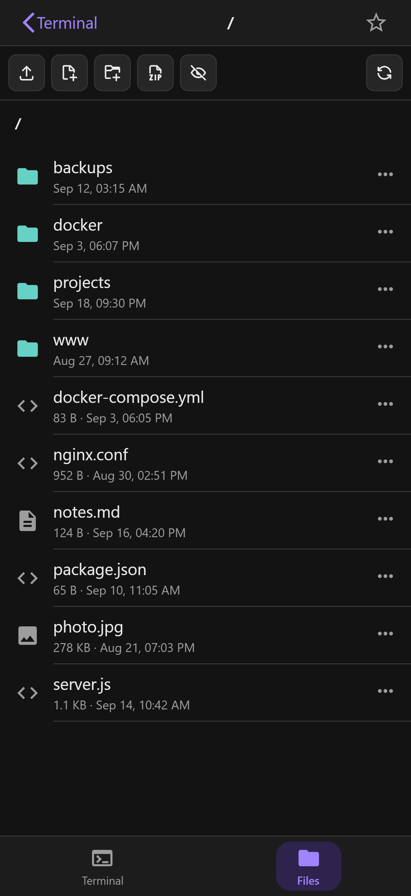
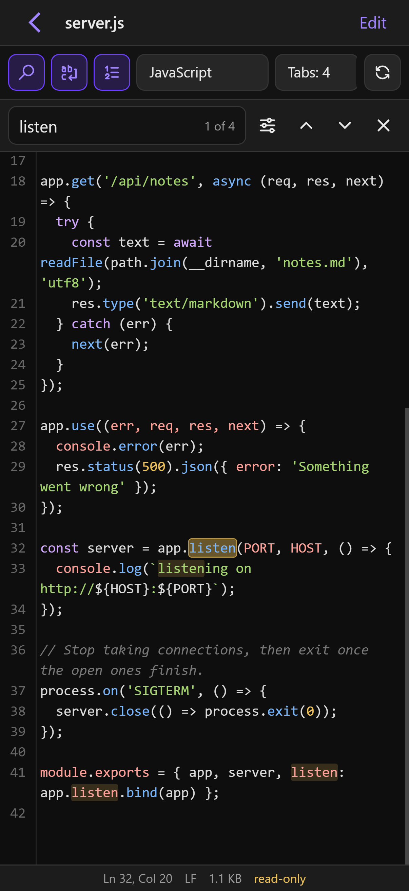

# picossh

A self-hosted SSH terminal and SFTP file manager built for phones. Run it on a
machine on your network, open it in the browser, add it to the Home Screen,
and it behaves like an app: saved servers, a terminal that survives the phone
going to sleep, a file manager and a text editor, all behind Face ID.

## Screenshots

| Servers | Terminal | Files | Editor |
| --- | --- | --- | --- |
|  |  |  |  |

## Features

**Terminal**
- Shells keep running while the app is in the background or the signal drops;
  the screen is replayed when you come back, and no keystroke is lost or sent
  twice.
- A touch keyboard with Ctrl/Alt, arrows, function keys and your own keys.
- Snippets: saved commands with `${placeholders}`, sent with one tap.

**Files**
- Browse over SFTP, upload and download (both resumable), rename, delete, and
  download a folder as zip.
- Favorite folders, and swipe to go back.

**Editor**
- Syntax highlighting, find and replace, and a viewer that opens files of any
  size.

**Security**
- Server passwords and keys encrypted at rest (AES-256-GCM).
- SSH keys generated by the app (Ed25519, RSA, ECDSA), so there is no pasting
  private keys on a phone.
- Face ID sign-in (passkeys), Face ID SSH keys, and an optional lock when the
  app comes back from the background.

**Admin dashboard** at `/admin`: devices, connections, traffic, memory and
settings.

## Quick start

picossh needs a password to sign in with (`APP_PASSWORD`) and, ideally, a
secret that encrypts what it stores (`APP_SECRET`).

### npm

Requires Node.js 20 or newer.

```sh
npm install -g picossh
APP_PASSWORD='a long password' APP_SECRET='a long random string' picossh
```

Or run it without installing: `npx picossh`. Data is kept in `~/.picossh`;
`picossh --help` lists the options.

### Docker

```sh
docker build -t picossh .
docker run -d --name picossh -p 3000:3000 -v picossh-data:/data \
  -e APP_PASSWORD='a long password' -e APP_SECRET='a long random string' \
  --restart unless-stopped picossh
```

### Docker Compose

```yaml
services:
  picossh:
    build: .
    ports: ["3000:3000"]
    volumes: ["picossh-data:/data"]
    environment:
      APP_PASSWORD: a long password
      APP_SECRET: a long random string
    restart: unless-stopped
volumes:
  picossh-data:
```

### From source

```sh
npm ci --omit=dev
APP_PASSWORD='a long password' APP_SECRET='a long random string' npm start
```

Then open http://localhost:3000 and sign in with `APP_PASSWORD`.

## Configuration

| Variable | Purpose |
| --- | --- |
| `APP_PASSWORD` | Required. The password you sign in with. Changing it signs every device out. |
| `APP_SECRET` | Encrypts stored passwords and keys. **Losing or changing it makes them unreadable.** If unset, one is generated into `secret.key` in the data directory. |
| `PORT` | Port to listen on (default `3000`). |
| `DATA_DIR` | Where data is stored (default `./data`, `~/.picossh` for the `picossh` command, `/data` in Docker). Back it up together with `APP_SECRET`. |
| `DNS_SERVERS` | Optional DNS servers used to resolve server names first (e.g. a LAN resolver for `.lan` names). Also settable in the app. |

Other limits (output kept per shell, background time, sign-in lockout, ...)
are changed on the admin dashboard.

## HTTPS and reverse proxy

Face ID sign-in, Face ID SSH keys and installing to the Home Screen need HTTPS
and a hostname. Put picossh behind a reverse proxy, for example Caddy:

```
picossh.example.lan {
  tls internal
  reverse_proxy localhost:3000
}
```

The proxy's `X-Forwarded-Proto` and `X-Forwarded-For` headers are used for
secure cookies and the sign-in rate limit.

picossh gives whoever signs in SSH access to your servers: keep it on your own
network or behind a VPN, and use a strong `APP_PASSWORD`.

## Face ID SSH keys

Create one under **SSH Keys → + → Face ID (this device)**, add its public key
to `~/.ssh/authorized_keys`, and connect. The server needs OpenSSH 8.4 or
newer; on 8.4 to 10.2, also enable the algorithm in `sshd_config`:

```
PubkeyAcceptedAlgorithms +webauthn-sk-ecdsa-sha2-nistp256@openssh.com
```

## Tips

On an iPhone, Safari always puts a bar with arrows and Done above the keyboard
in the editor and forms (the terminal uses picossh's own keyboard, so it has
none). To make it smaller, turn off **Settings → General → Keyboard →
Predictive Text**.

## Credits

Built on [xterm.js](https://xtermjs.org), [ssh2](https://github.com/mscdex/ssh2),
[highlight.js](https://highlightjs.org) and
[SimpleWebAuthn](https://simplewebauthn.dev). Icons from
[Material Icons](https://github.com/google/material-design-icons) (Apache 2.0),
[Tabler Icons](https://tabler.io/icons) (MIT) and
[VS Code Codicons](https://github.com/microsoft/vscode-codicons)
(CC BY 4.0, © Microsoft; some redrawn).

## License

[MIT](LICENSE)
